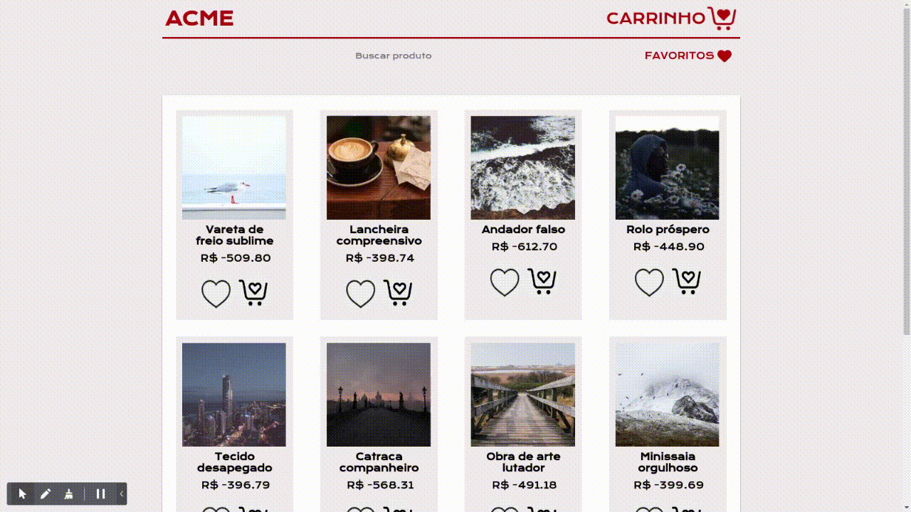
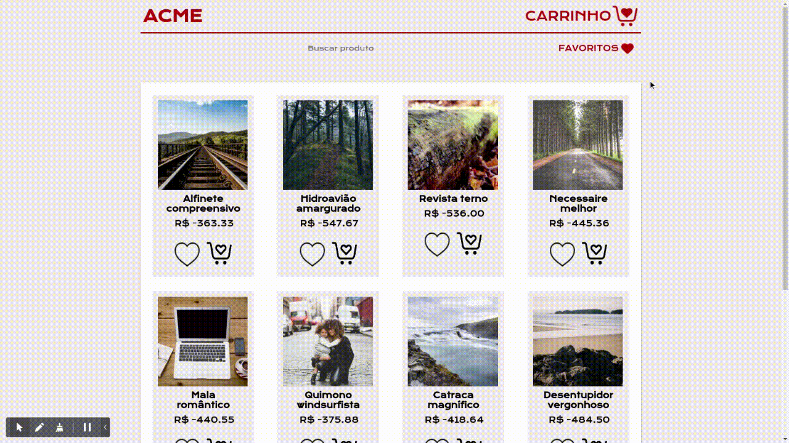
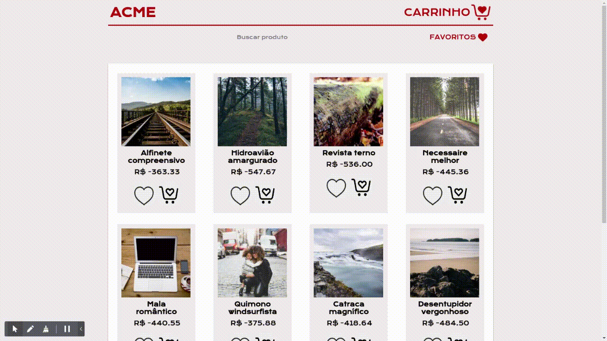

# ACME Store

Esse projeto tem como intuito desenvolver uma loja virtual para uma empresa fictícia chamada Acme, empresa que foca na venda de produtos genéricos.

## Funções
* Gerar produtos com imagens e nomes aleatórios
 

    
    
* Filtrar produtos por nome
 

    
  
* Adicionar produto aos favoritos
* Filtrar favoritos
* Remover itens dos favoritos
  

     
 
* Visualizar produto
    

      
 
* Adicionar produto ao carrinho
* Visualizar produtos no carrinho
* Somar preço dos produtos
* Remover produto do carrinho e atualizar valores
    

      

## Desenvolvimento
Clone o projeto
    `git@github.com:mabiiak/acme-store.git`

Entre na pasta do repositório que você acabou de clonar
    `cd acme-store`

Inicialize o projeto
    `npm start`

## Links
API utilizada para gerar as imagens: [Lorem Picsum](https://picsum.photos/)
[Licença de uso](https://github.com/DMarby/picsum-photos/blob/main/LICENSE.md)

API utilizada para gerar os textos: [Dicio API](https://github.com/ThiagoNelsi/dicio-api)

